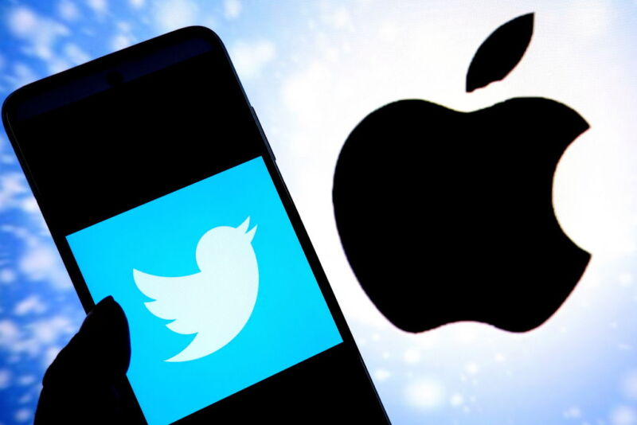
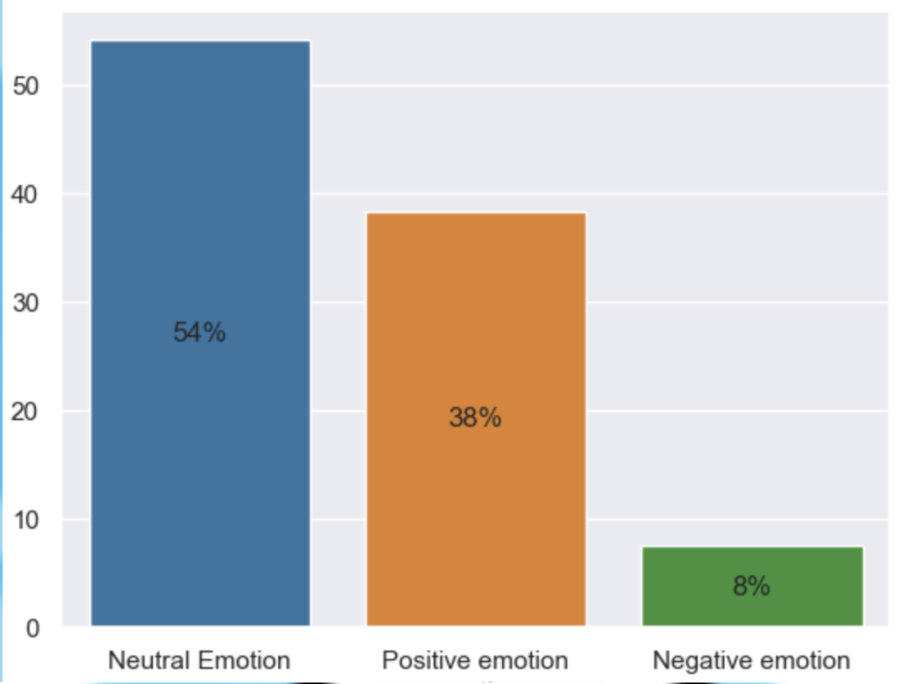
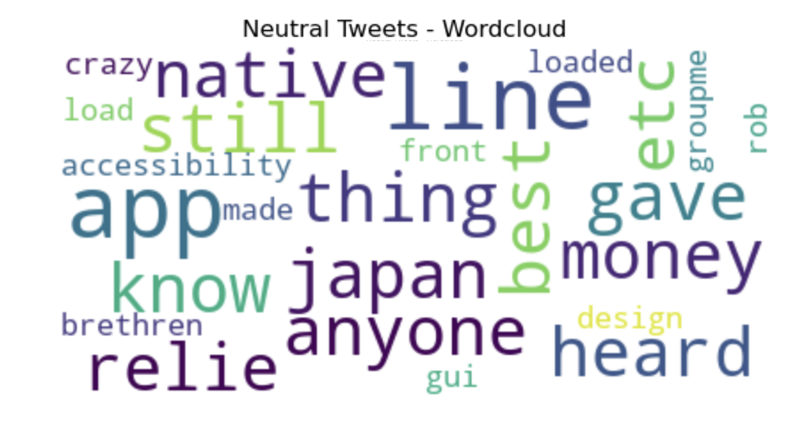

# Twitter Sentiment Analysis - Apple Inc.

### Authors: Harshitha Thota, Namsoo Lee, Wes Smolen

## Overview
The marketing department at Apple is actively seeking data-driven insights and actionable recommendations through social media monitoring, specifically focusing on tweets from the 2013 SXSW event. This analysis aims to predict neutral emotion displayed in tweets. Multiple models were explored, leading to the selection of the Multinomial Naive Bayes model as the final model with an Accuracy score of 64%.

## Business Problem
The primary business problem is to develop a Natural Language Processing (NLP) model capable of accurately classifying the sentiment of a tweet based on its content. This model will help Apple understand how consumers feel about the company and the products and make informed decisions to enhance customer satisfaction.

## Data Understanding
The dataset used in this analysis is sourced from [CrowdFlower](https://data.world/crowdflower/brands-and-product-emotions) via data.world. The dataset comprises over 9,000 tweets that have been manually rated by human raters for sentiment – positive, negative, or neutral.

## Methods
To train our model we vectorized the words from our tweets. We also made all words lowercase, lemmatized all words, removed stopwords, and removed punctuation. We generated word clouds focusing on neutral tweets. The follwing words stood out - line, app, design and GUI.

## Results
We were able to get an Accuracy score of 66% by using Multinomial Naive Bayes model. While there is room for improvement, the results already provide valuable insights. 

## Conclusions
 This analysis leads to the recommendations for swaying customer sentiment about Apple. Based on the word clouds we suggest that Apple's product development team and marketing team focus on incentivizing consumers, app functionality, focusing on better design and GUI and ensuring a seamless purchase experience for the consumers. 

## Next steps
Further analysis is essential to guide Apple's Marketing and Product Design teams in making data-driven decisions:
* Acquire recent data from Twitter
* Broaden analysis scope outside of SXSW
* Conduct device or product specific analysis - iPad, iPhone and iTunes

## For more information
The complete analysis can be found in our Jupyter Notebook and our presentation.
For any additional questions, please contact our team:
Harshitha Thota, Namsoo Lee, Wes Smolen

## Reposity Structure

